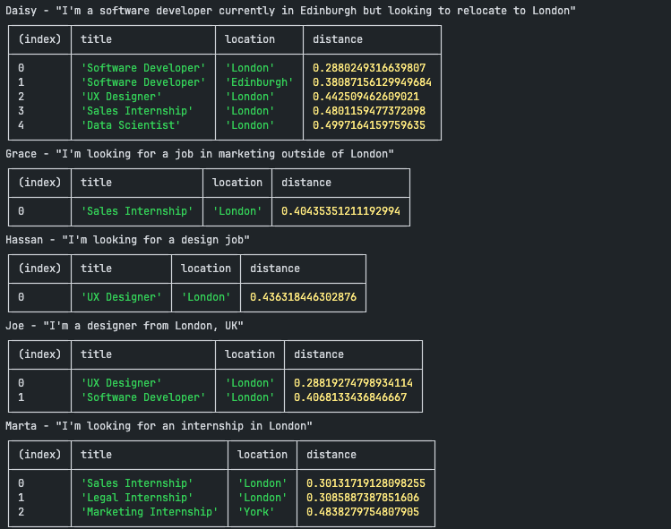

# Bright Network Job Recommendation Engine Technical Test

## The Brief

```text
At Bright Network, matching graduates with their ideal first jobs and employers with their ideal graduate intake is core to what we do. This technical challenge is designed to give you a flavour of what it might be like to work for us and for us to assess the kind of developer you are and the skills and approach to problem-solving you're bringing to the table.

In one of our suggested programming languages, please implement a very simple recommendations algorithm to match members to their perfect job.

The code needs to fetch the required data from the following APIs:

https://bn-hiring-challenge.fly.dev/members.json
https://bn-hiring-challenge.fly.dev/jobs.json

For each member, please print their name and their recommended job(s).
```

## Installation & Running

```bash
npm install
```

The application uses a PostgresSQL database. I've provided a simple dockerfile to generate. You may need to tweak ports if you have a collision `Dockerfile-db`

```bash
docker compose up -d
```

Copy .env.example to .env and update the connection string.

```bash
npm run migrate:dev # prepare the database
```

```bash
npm run importer # downloads from the database and populates the db. First run may be slow as it downloads the model.
npm run matcher # outputs the results to the console
```

## Observations

Inspecting the members API reveals the bio is an unstructured sentence, rather than structed data e.g. { role: "designer", desiredLocation: "London" }

member.bio contains:

- Negations - "outside of London" meaning NOT London.
- No location - "I'm looking for a design job"
- Unclear if a specified location means it's a requirement - "I'm a designer from London"
- Red-herring locations - "currently in Edinburgh but looking to relocate to London" meaning "London, Not Edinburgh"
- Role variants - "Designer", "design job"

### Potential misconceptions

1. The bio is always a short sentence.
2. The bios contains only relevant information.

## Expected Results

The sample data is simple enough we can map it to expected results.

| Member | Desired Role       | Desired Location | Recommended Job(s)                                  |
| ------ | ------------------ | ---------------- | --------------------------------------------------- |
| Joe    | designer           | London           | UX Designer/London                                  |
| Marta  | internship         | London           | Legal Internship/London<br/>Sales Internship/London |
| Hassan | design job         | -                | UX Designer/London                                  |
| Grace  | marketing          | Not London       | Marketing Internship/York                           |
| Daisy  | software developer | London           | Software developer/London                           |

## Discovery

`bio` is an unstructured sentence, this points me towards Natural Language Processing.

Two products that I researched briefly were [Amazon Personalize](https://aws.amazon.com/personalize/) and [Amazon Comprehend](https://eu-west-1.console.aws.amazon.com/comprehend/home?region=eu-west-1#welcome). Amazon Personalize is a recommendation engine which involves training a model. Amazon Comprehend can extract key phrases, entities and sentiments, from unstructured documents. Unfortunately, the amount of additional research I'd require would outstretch the time contraints, so I move on.

I eventually arrived at [Hugging Face Transformers.js](https://huggingface.co/docs/transformers.js/index).

### NLP Tasks

A number of tasks are available which may help build a solution.

#### Summarization

Can this be used to make concise alternative bios?
Unfortunately, the this made some bios longer. All bios are concise enough. Moving on. See limitations.

#### Text Classifications

Using Question Natural Language Inference (QNLI) to determine score if a bio and a job spec are a good match.
Unfortuntely, I couldn't find a ONNX compatible model to use here.

#### Token Classification

This can identify Locations well. However, I couldn't find a fine-tuned model supporting professions. It also to split at individual words rather than strings like "software developer"

#### Feature Extraction

With this task I can convert a string to a vector representation. A distance algorithmn can be used to compare job specs to member bios.

## Approach

I've split the application into two distinct steps, importing and matching.

Creating vectors of each job spec and bio could be time-consuming as the APIs return more data. These vector can then be stored in a PostgreSQL database using the `pgvector` extension. By querying the distances between job specs and member bios, we can efficiently match members to their ideal jobs.

A challenge with comparing distances is defining a good threshold. This will need some experimentation. A threshold that looks great for one member could exclude a valid job for another.

## Results

You can see a number of the observations haven't been addressed in the current code. I've listed a number of next steps below that may push the returned results closer to the expected.

It's an OK start given the time available for research, tweaking and expansion. I do still believe going in the ML direction is an appropriate one.

Tweaking the threshold, currently 0.5, would close in on expectated results for some members, but worsen results for others.



## Limitations

### Bio size

In the current members API response, all bios are a single single sentence. For the purpose of this exercise, that is an assumption that I have followed. However, from the feature extraction model's description:

> By default, input text longer than 384 word pieces is truncated.
> [https://huggingface.co/sentence-transformers/all-mpnet-base-v2](https://huggingface.co/sentence-transformers/all-mpnet-base-v2)

## Next steps

- Explore a GPT powered approach
- Explore other models such as [https://huggingface.co/TechWolf/JobBERT-v2](https://huggingface.co/TechWolf/JobBERT-v2)
- Fine-tune my own model using bios similar to the existing API responses.
- Consider a tuned stopwords list. Removing words such as "I'm", "looking", "job" could improve the distance results, particularly for long bios.
- Refactor and test, particularly data transformation steps
- Host the applications. The importer step would be well suited to ECS, potentially AWS Fargate. The matcher could be converted to a Lambda function.
